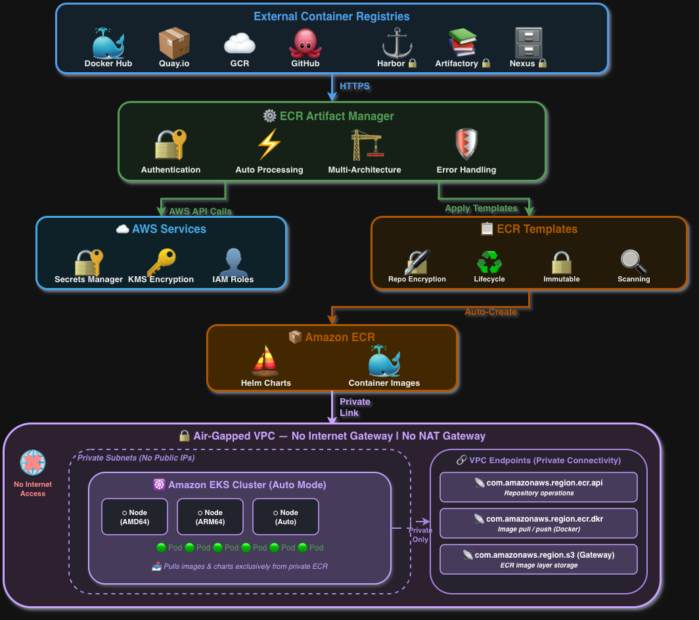

# ECR Automation for Air-Gapped Environments

> **Important:** This is sample code for demonstration and educational purposes. You should work with your security and legal teams to meet your organizational security, regulatory, and compliance requirements before deployment. This sample is not intended for production use without additional security testing and review.

Automation for managing Amazon ECR repositories in air-gapped and restricted network environments using AWS Repository Creation Templates.

## Overview

This pattern provides a solution for:
- Automating ECR repository creation with security-by-default settings
- Migrating Helm charts and container images from public registries to private ECR
- Enforcing security standards (AWS KMS encryption, immutable tags, vulnerability scanning)
- Supporting air-gapped deployments with no internet connectivity after initial migration

## Key Features

- **Zero-Touch Repository Creation:** Leverage ECR Repository Creation Templates with CREATE_ON_PUSH
- **Multi-Architecture Support:** Preserve platforms (amd64, arm64, etc.) during migration
- **Security by Default:** Customer-managed AWS KMS encryption, immutable tags, enhanced scanning
- **Comprehensive Tooling:** 5,000+ line migration tool with error handling and retry logic
- **Air-Gap Compatible:** Offline deployment after initial artifact migration

## Quick Start

### Prerequisites

- AWS CLI v2.15.0 or later
- Terraform 1.0 or later
- Docker 20.10 or later (with BuildKit)
- Helm 3.0 or later
- jq 1.6 or later
- yq 4.0 or later

### 1. Deploy Infrastructure

```bash
cd terraform
cp terraform.tfvars.example terraform.tfvars
# Edit terraform.tfvars for your environment
terraform init
terraform plan
terraform apply
```

### 2. Migrate Artifacts

```bash
cd ecr-manager-tool

# Create configuration file
cp charts-config.yaml charts-config.yaml.local
# Edit charts-config.yaml.local with your charts

# Run migration
./ecr-artifact-manager.sh --config charts-config.yaml.local --region us-east-1
```

### 3. Deploy to EKS

```bash
# Pull from private ECR
helm install my-app oci://<account-id>.dkr.ecr.us-east-1.amazonaws.com/helmchart/my-app --version 1.0.0
```

## Documentation

- [Architecture Overview](docs/ARCHITECTURE.md) - System design and components
- [Deployment Guide](docs/DEPLOYMENT-GUIDE.md) - Step-by-step instructions
- [ECR Manager Tool](ecr-manager-tool/README.md) - Migration tool usage and options
- [Security Best Practices](docs/SECURITY.md) - Security configuration
- [Troubleshooting](docs/TROUBLESHOOTING.md) - Common issues and solutions
- [Cost Analysis](docs/COST-ANALYSIS.md) - Cost estimation and optimization
- [Scaling Guide](docs/SCALING-GUIDE.md) - Large-scale deployments
- [Migrating Existing Repositories](docs/MIGRATING-EXISTING-REPOSITORIES.md) - Brownfield strategies

## Use Cases

- **Financial Services:** Deploy containerized applications in regulated environments
- **Healthcare:** HIPAA-compliant container registry management
- **Government:** Air-gapped deployments for classified networks
- **Manufacturing:** Isolated production environments
- **Energy:** Secure operational technology (OT) networks

## Key Benefits

- **Significant Time Savings** in repository setup (from hours of manual work to minutes with automation)
- **Consistent Security Standards** through template enforcement across repositories
- **Reduced Configuration Errors** compared to manual repository setup
- **No Internet Dependency** after initial migration

## Architecture



The architecture shows the end-to-end flow:
1. **External Registries** — Helm charts and container images are pulled from public registries (Docker Hub, Quay.io, GitHub, GCR) and private registries (Harbor, Artifactory) via HTTPS
2. **ECR Artifact Manager** — Handles authentication, multi-architecture processing, and error handling
3. **AWS Services** — AWS Secrets Manager for private registry credentials, AWS KMS for encryption, AWS IAM for access control
4. **ECR Templates** — Repository Creation Templates auto-create repositories with encryption, lifecycle policies, immutable tags, and scanning
5. **Amazon ECR** — Stores Helm charts and container images with security controls applied
6. **Air-Gapped VPC** — Amazon EKS cluster pulls exclusively from private ECR via VPC endpoints (ecr.api, ecr.dkr, S3 gateway)

## Security

> **Shared Responsibility:** Security is a shared responsibility between AWS and the customer. This pattern configures AWS service-level security controls, but customers are responsible for their own organizational security requirements, access management, and compliance validation. See the [AWS Shared Responsibility Model](https://aws.amazon.com/compliance/shared-responsibility-model/).

- **Encryption at Rest:** Customer-managed AWS KMS keys with automatic rotation
- **Immutable Tags:** Prevent tag overwrites and help maintain image integrity
- **Vulnerability Scanning:** Enhanced scanning with SCAN_ON_PUSH and CONTINUOUS_SCAN
- **Audit Logging:** CloudTrail logging of ECR operations
- **Least Privilege IAM:** Dedicated service roles with scoped permissions

## Compliance

This pattern can help support compliance with the following frameworks. Customers are responsible for validating that their specific implementation meets their compliance requirements:
- SOC 2 (CC6.1, CC6.6, CC7.2)
- PCI-DSS (Requirements 3, 6, 10)
- HIPAA (§164.312)
- NIST 800-53 (SC-28, AU-2, SI-2)

## Cost Estimation

| Deployment Size | Repositories | Storage (GB) | Monthly Cost |
|----------------|--------------|--------------|--------------|
| Small          | 1-20         | 10-50        | $16          |
| Medium         | 20-100       | 50-200       | $66          |
| Large          | 100-500      | 200-1000     | $131-500     |
| Enterprise     | 500+         | 1000+        | $500+        |

See [Cost Analysis](docs/COST-ANALYSIS.md) for detailed breakdown.

## Support

- **Issues:** Report issues via GitLab Issues
- **Documentation:** See [docs/](docs/) directory
- **AWS Support:** Contact AWS Support for service-related issues

## Contributing

Contributions are welcome! Please see [CONTRIBUTING.md](CONTRIBUTING.md) for guidelines.

## License

This project is licensed under the MIT-0 License - see [LICENSE](LICENSE) file for details.

## Authors

- AWS Prescriptive Guidance Team
- Community Contributors

## Acknowledgments

- AWS ECR Team for Repository Creation Templates feature
- AWS Community for feedback and testing
- Open source projects: Helm, Docker, Terraform

## Related Resources

- [AWS Prescriptive Guidance](https://aws.amazon.com/prescriptive-guidance/)
- [Amazon ECR Documentation](https://docs.aws.amazon.com/ecr/)
- [Repository Creation Templates](https://docs.aws.amazon.com/AmazonECR/latest/userguide/repository-creation-templates.html)
- [EKS Best Practices](https://aws.github.io/aws-eks-best-practices/)

## Version History

- **1.0.0** (2026-01-30) - Initial release
  - Repository Creation Templates support
  - Multi-architecture image migration
  - Comprehensive error handling
  - Air-gapped deployment support
